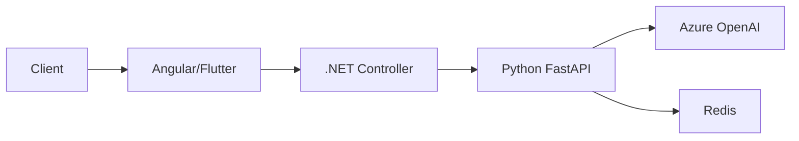
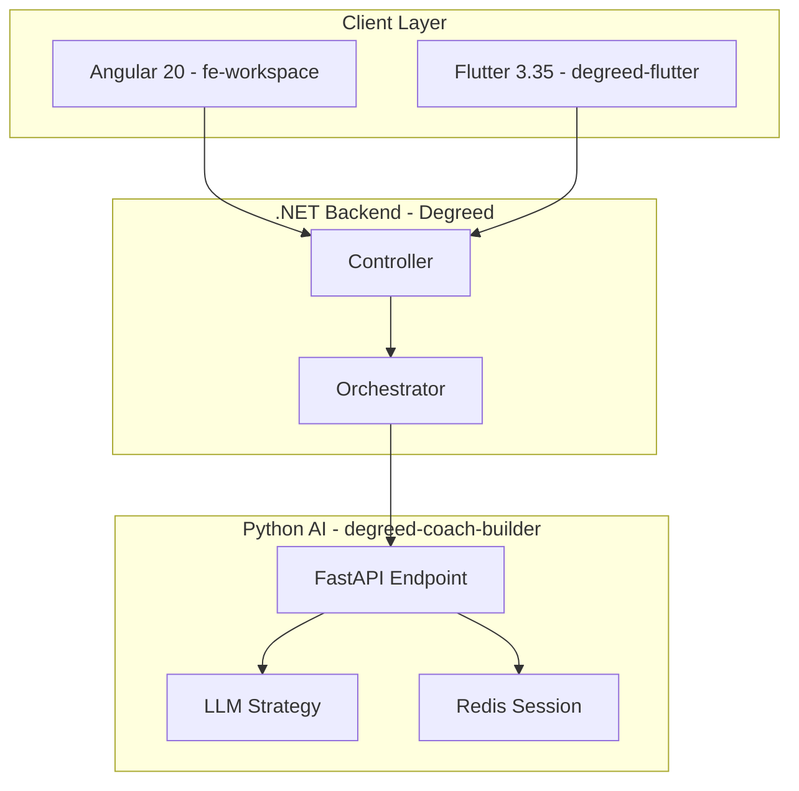
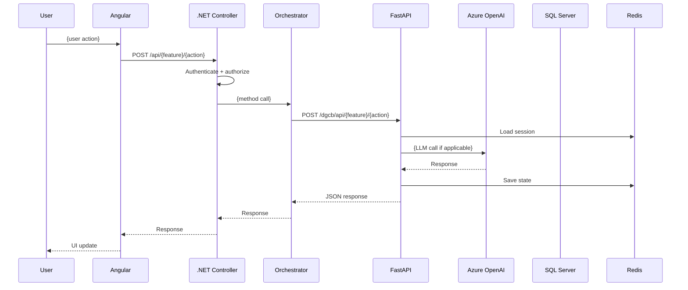
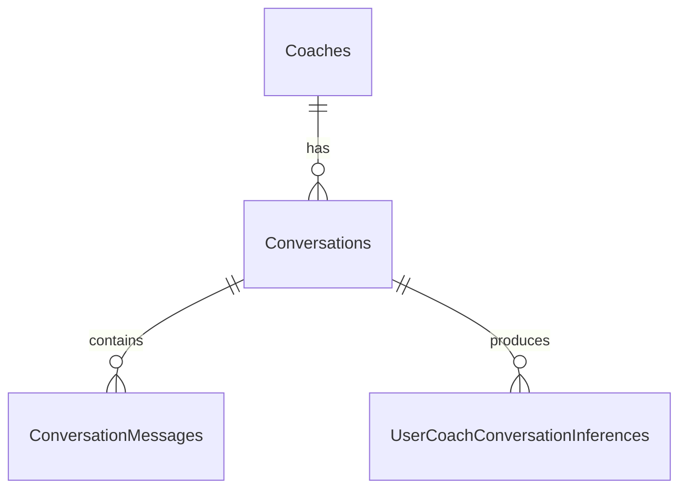

# Feature Documentation — Solution Design Document (SDD)

Create a comprehensive Solution Design Document on Confluence following Degreed's official SDD format from the Architecture Guild. This is NOT a status report — it's a full architecture document with diagrams, data flows, security analysis, and performance considerations, presentable to other engineers and leadership.

## Reference

**SDD Template:** `https://degreedjira.atlassian.net/wiki/spaces/AG/pages/5848400079/Solution+Design+Docs`
**Existing SDDs:** Read 2-3 real SDDs from that space to match the tone and depth before writing.

## Constants

```
JIRA_CLOUD_ID = "151636d7-9099-4803-a108-4f053f36c9fe"
CONFLUENCE_SPACE_ID = "5895915199"
CONFLUENCE_SPACE_KEY = "~712020a0b63342badc4b25ab05e1dc1cb61a3d"
```

## Instructions

### 1. Gather All Artifacts

Read all outputs from prior phases:
- **Phase 0 (Intake):** Requirements, affected systems, Epic details, linked resources
- **Phase 1 (Research):** Research document — impact analysis, building blocks, data inventory, feature flag divergence, edge cases, external research
- **Phase 2 (ADR):** Architecture decision — 3 approaches, weighted scores, Mermaid diagrams
- **Phase 3 (Approaches):** PR links, implementation summaries, test results, API contracts
- **Phase 3.5 (Review):** Code review report, dependency validation, accessibility audit, migration safety
- **Phase 5 (Test Skill):** Test skill details, test scenarios
- **Visual artifacts:**
  - `docs/builds/{EPIC-ID}-design/figma-screenshot.png` — Figma reference (if exists)
  - `docs/builds/{EPIC-ID}-evidence/*.png` — Playwright captures from deploy + live test
  - `docs/builds/{EPIC-ID}-evidence/axe-*.json` — a11y scan results

The SDD MUST embed these visuals — design intent + as-shipped reality, side by side. Anyone reading the SDD should see the feature, not just read about it.

### 2. Target Space

**All writes go to space ID `5895915199`** (key: `~712020a0b63342badc4b25ab05e1dc1cb61a3d`).
Reading from any space is fine.

### 3. Write the SDD

Follow the Degreed SDD template structure. This is what the document MUST contain — adapt each section to the specific feature.

---

#### SDD Structure

```markdown
# Solution Design Doc — {Feature Name}

| **Author, from Team** | AI Feature Builder + {user name} |
|---|---|
| **Collaborators** | {stakeholders from the Epic} |
| **Scheduled Review Date** | {today + 7 days} |
| **Status** | New |
| **Impacts** | {Front-End / Back-End / Database / Infrastructure — list all that apply} |
| **Jira Epic** | {EPIC-ID} |
| **PRs** | {links to approach PRs} |

---

# Executive Summary

{Single paragraph readable by both engineering and non-technical audiences. Define the problem AND the high-level solution. Anyone reading this should know whether they need to review the full doc.}

---

# Why are we doing this?

## Problem Statement

{Clear description of the problem. Link to the Jira Epic for full context. This should be understandable by a non-expert. Pull from the intake requirements but write it as a narrative, not a bullet list.}

## Current State

{How the system works TODAY in the area this feature touches. Include a diagram:}



{Describe the current data flow, what exists in the database, what the user experience looks like now. Reference specific files and modules — not paths, but what they do.}

## Functional Requirements

{Numbered list of what the feature must do. Each should be testable.}

1. {FR-1: The system shall...}
2. {FR-2: The system shall...}

## Non-Functional Requirements

{Performance, security, scalability, accessibility requirements.}

1. {NFR-1: Response time shall be under X ms}
2. {NFR-2: Feature shall be behind a LaunchDarkly flag}

---

# What are we doing?

## Proposed Solution

{Describe the selected approach in detail. Write for a technical audience but avoid jargon where possible. This is the ARCHITECTURE section — explain WHY things are designed this way, not just WHAT.}

### Architecture Overview

{High-level architecture diagram showing all components involved:}



### Request Flow

{Detailed sequence diagram showing the full request lifecycle:}



### Proposed Interface Definitions

{Every new or modified API endpoint — full contract:}

| Method | Endpoint | Request Body | Response | Description |
|--------|----------|-------------|----------|-------------|
| POST | `/dgcb/api/{feature}/{action}` | `{ field1, field2 }` | `{ status, data }` | {what it does} |
| GET | `/api/{feature}/{result}` | — | `{ result }` | {what it does} |

### Data Model Changes

{If database changes are needed, show the schema:}

```sql
-- New table or column additions
ALTER TABLE aicoach.{Table}
ADD {Column} {Type} {Constraints};

-- New stored procedure (if any)
CREATE PROCEDURE aicoach.{SP_Name}
    @param1 INT,
    @param2 NVARCHAR(MAX)
AS BEGIN
    -- {description}
END
```

{Entity relationship diagram if helpful:}



### Session & Cache Design

{If Redis/session state is involved:}

| Key Pattern | TTL | Purpose | Data Shape |
|-------------|-----|---------|-----------|
| `session:{id}` | 24h | Session state | `SessionDataModel + new fields` |

### Feature Flag Strategy

{How the feature is gated:}

| Flag | Default | Controls | Rollout Plan |
|------|---------|----------|-------------|
| `{FlagName}` | OFF | {what it gates} | Internal → 10% → 50% → 100% |

## Code Location

{Where the implementation lives across repos — NOT file paths, but descriptions:}

| Repository | Location | What |
|-----------|----------|------|
| degreed-coach-builder | `backend/app/api/{feature}/` | FastAPI endpoints and business logic |
| Degreed | `trunk/.../Controllers/Api/` | .NET controller and orchestrator |
| fe-workspace | `apps/lxp/src/app/{feature}/` | Angular components, services, facades |
| degreed-flutter | `lib/{feature}/` | Flutter cubit, UI, repository |

## Visuals

{Include ALL diagrams AND visual evidence here. Anyone reading the SDD should see the feature, not just read about it.}

### Architecture & Flow Diagrams (Mermaid)

1. **Architecture diagram** — component layout showing all services
2. **Sequence diagram** — request flow for the primary use case
3. **Data flow diagram** — how data moves between layers
4. **State diagram** — if the feature has state transitions (e.g., session lifecycle)
5. **ER diagram** — if database changes are involved

### Design Reference (from Figma — if a Figma source exists)

Pull the canonical design frame using the Figma MCP and embed it (or attach via Confluence image upload):
```
mcp__plugin_figma_figma__get_screenshot({fileKey, nodeId})
```
- Embed the Figma screenshot saved at `docs/builds/{EPIC-ID}-design/figma-screenshot.png`
- Caption: **"Design intent — {Feature Name} ({Figma URL})"**

### As-Shipped Reality (from Playwright captures during deploy + live test)

Embed the screenshots saved at `docs/builds/{EPIC-ID}-evidence/` so the SDD shows what's actually deployed:
- Default state — `{feature}-default.png`
- Primary action / loading state — `{feature}-after-action.png`
- Error / empty / disabled states — one image per state
- Caption each: **"As shipped on {pr-env-url}"**

### Side-by-Side: Design vs As-Shipped

A two-column table comparing intent and reality for each key state. Flag any > 5% pixel diff or behavioral drift in the right column.

| State | Figma | As Shipped | Notes |
|-------|-------|-----------|-------|
| Default |  |  | {drift notes} |
| Loading |  |  | {drift notes} |
| Error   |      |      | {drift notes} |

### Accessibility Evidence

- Live axe-core scan results (WCAG 2.2 AA): {count} violations — full report at `docs/builds/{EPIC-ID}-evidence/axe-{route}.json`
- Keyboard navigation verified: {Yes/No}
- Screen reader names verified via accessibility tree: {Yes/No}

{Do NOT include code snippets here unless absolutely necessary to explain an architectural concept. Diagrams + visual evidence > code.}

---

# What else is impacted?

## Dependencies

### Upstream Dependencies
{Services this feature depends on:}
| Service | What We Need | Impact if Unavailable |
|---------|-------------|---------------------|

### Downstream Impacts
{What other services/features are affected by our changes:}
| Service/Feature | Impact | Coordination Needed |
|----------------|--------|-------------------|

### Deployment Strategy
{Order of deployment across services:}
1. Database migration (if any)
2. Python service (degreed-coach-builder)
3. .NET backend (Degreed)
4. Frontend (fe-workspace) — does NOT require coordinated deploy
5. Mobile (degreed-flutter) — separate release cycle

{Rollback plan for each layer.}

## Security and Privacy Concerns

{From the review phase. List any:}
- New attack surfaces (new public endpoints)
- New data being stored or processed
- Changes to authentication or authorization
- PII handling

## Performance Considerations

### Performance Goals
| Metric | Target | Measurement |
|--------|--------|------------|
| p95 latency | < {X}ms | Datadog APM |
| Throughput | {N} req/s | Load test |

### Potential Bottlenecks
| Bottleneck | Mitigation |
|-----------|------------|
| {e.g., LLM call latency} | {e.g., streaming SSE, async processing} |

### Caching Strategy
{What's cached, where, TTL, invalidation rules}

### Monitoring & Observability
{Datadog dashboards, alerts, log queries to set up post-deploy}

---

# Testing Considerations

### What Needs to Be Tested
{From the test skill generation — key scenarios:}
1. {Happy path flow}
2. {Edge cases identified in research}
3. {Cross-service integration}
4. {Feature flag on/off behavior}

### Testing Strategy
| Type | Scope | Tool |
|------|-------|------|
| Unit | Per-repo | pytest / xUnit / Jest / flutter test |
| Integration | Cross-service | Generated test skill (`tools/{feature}/`) |
| E2E | Full flow | Manual or Cypress |

### Test Skill
- Skill: `.claude/skills/{feature}-test/SKILL.md`
- Tool: `tools/{feature}/{feature}_chat.py`
- Commands: `login`, `{primary flow}`, `verify`, `integration`, `smoke`

---

# Risks

| Risk Type | Risk | Status | Mitigation |
|-----------|------|--------|------------|
| Security | {risk} | Mitigated | {how} |
| Performance | {risk} | Accepted | {why} |
| Data | {risk} | Partially mitigated | {what remains} |
| Dependency | {risk} | Mitigated | {how} |

---

# Considered Alternatives

{From the ADR — the approaches that were NOT selected:}

## Approach {B}: {Name}
**Why considered:** {what was attractive about it}
**Why discarded:** {specific technical reasons}
**Trade-offs:** {what we'd gain vs lose}

## Approach {C}: {Name}
{same structure}

### Comparison Matrix
| Criteria | Selected ({A}) | Alternative ({B}) | Alternative ({C}) |
|----------|---------------|-------------------|-------------------|
| Maintainability | {score} | {score} | {score} |
| Performance | {score} | {score} | {score} |
| Implementation Risk | {score} | {score} | {score} |
| Lines of Code | {count} | {count} | {count} |

---

# Appendices

## A. Detailed Data Flow Diagrams
{Additional diagrams that didn't fit in the main Visuals section}

## B. External Research
{Key findings from internet research — industry patterns, library docs, similar implementations. Summarize, don't paste entire articles.}

## C. PR Links
| Approach | Repository | PR |
|----------|-----------|-----|
| A (Selected) | degreed-coach-builder | {link} |
| A (Selected) | Degreed | {link} |
| A (Selected) | fe-workspace | {link} |

## D. References
{External links, documentation, articles that informed the design}
```

---

### 4. Writing Guidelines

**DO:**
- Write for an audience of engineers who don't know this feature
- Use diagrams heavily — Mermaid sequence, component, ER, state diagrams
- Explain WHY architectural decisions were made, not just WHAT
- Include performance targets with specific numbers
- Show the full request flow end-to-end
- Document the deployment order and rollback plan
- Keep it presentable — someone should be able to present this in a design review

**DO NOT:**
- Dump code snippets everywhere — use sparingly, only for API contracts and schema changes
- Write a status report ("we did X then Y then Z")
- Skip diagrams ("N/A" is not acceptable for a multi-service feature)
- Leave placeholder text from the template
- Forget security/privacy analysis
- Skip the alternatives section — show the team considered options

### 5. Create the Page

Use `mcp__atlassian__createConfluencePage`:
```
cloudId: "151636d7-9099-4803-a108-4f053f36c9fe"
spaceId: "5895915199"
title: "Solution Design Doc — {Feature Name}"
contentFormat: "markdown"
```

### 6. Update Jira

Post a comment on the Epic:
```
AI Feature Builder — Solution Design Document Published

SDD: {Confluence page link}

The document covers:
- Executive summary and problem statement
- Architecture diagrams (component, sequence, data flow)
- API contracts and data model changes
- Security, performance, and deployment considerations
- 3 approaches compared with recommendation
- Testing strategy and test skill
- Risk assessment

Ready for Architecture Guild review.
```

### 7. Present to User

```
## Solution Design Document Published

**Confluence:** {link}
**Title:** Solution Design Doc — {Feature Name}

Sections:
- Executive Summary
- Problem Statement + Current State
- Proposed Solution with architecture diagrams
- API contracts + data model changes
- Dependencies + deployment strategy
- Security + performance analysis
- Testing strategy + test skill
- Risks + alternatives considered

The doc follows the Degreed SDD template and is ready for AG review.
```

## Docling-Powered Alternative (Optional)

For complex documents, use the Docling MCP for structured creation:
1. `mcp__docling__create_new_docling_document`
2. `mcp__docling__add_title_to_docling_document`
3. `mcp__docling__add_section_heading_to_docling_document`
4. `mcp__docling__add_paragraph_to_docling_document`
5. `mcp__docling__add_table_in_html_format_to_docling_document`
6. `mcp__docling__export_docling_document_to_markdown`

## Tips

- **Read 2-3 real SDDs** from the AG space before writing — match the tone and depth
- **Diagrams are mandatory** — every SDD needs at least an architecture diagram and a sequence diagram
- **Mermaid syntax** works in Confluence — use it for all diagrams
- **No code dumps** — only show code for API contracts, SQL schema, and critical algorithmic decisions
- **Write for the reviewer** — the AG Guild will review this; make it easy for them to understand and approve
- **Link, don't repeat** — link to the Jira Epic, PRs, and local docs rather than copying content
