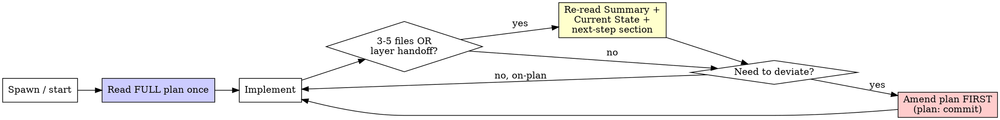

# Plan Adherence (Anti-Drift Contract)

## Overview

When a written implementation plan exists, the plan is the source of truth. You follow the plan; deviations amend the plan **first**, then change code.

**Core principle:** Code that diverges from the plan without a recorded amendment is undocumented drift. Drift is invisible on restart, defeats review, and rots the plan until it no longer describes the system.

**Violating the letter of the rules is violating the spirit of the rules.**

This is a **rigid** skill. Follow it exactly. Don't adapt the discipline away because a change feels small or obvious.

## When to Use

- You're executing tasks from a plan written by `superpowers:writing-plans` (or any committed implementation plan).
- You're about to create a new file, endpoint, DTO, dependency, or feature flag.
- You think the plan's approach is wrong and a different one is better.
- The user redirected you mid-implementation ("actually do X instead").
- You've changed several files and haven't looked at the plan in a while.

**REQUIRED BACKGROUND:** `superpowers:writing-plans` (produces the plan), `superpowers:executing-plans` (drives the loop). This skill governs what happens when execution wants to leave the plan.

## The Iron Law

```
NO CODE THAT DEVIATES FROM THE PLAN WITHOUT AMENDING THE PLAN FIRST
```

Found a better approach? Amend the plan, then code.
User redirected you? Record the redirect in the plan, then code.
Hit a blocker that forces a workaround? Amend the plan with the workaround, then code.

The amendment is a **separate commit** (`plan: ...`) so the change of intent is preserved in history, distinct from the code that implements it.

## What MUST Be in the Plan Before You Write It

| Must amend plan first | Just do it (no amendment) |
|---|---|
| Any new file created from scratch | Variable renames inside a function |
| Any new public API / endpoint / route | Comment or typo fixes |
| Any cross-layer change | Test refactors that don't change what's tested |
| Any change to request/response/DTO shapes | One-line tweaks inside a function the plan already names |
| Any new package / dependency | Bug fixes inside a step the plan already covers |
| Any new feature flag | — |

## The Re-Read Cadence

You drift because the plan fades from context as you code. Refresh it:



Re-reading Summary + Current State costs ~1K tokens. Wandering off-pattern costs a blocked review and a rewrite.

## Common Rationalizations

| Excuse | Reality |
|--------|---------|
| "The plan says X but Y is clearly better — I'll just do Y" | Undocumented improvement is still drift. Amend to Y, then build Y. |
| "It's a small change, not worth amending" | New file / API / DTO / dep / flag is never "small." Check the table. |
| "I'll update the plan at the end to match what I built" | Backfilling the plan to match code hides drift — it doesn't record intent. Amend BEFORE coding. |
| "The user redirected me, I'll just do it" | Redirects vanish on restart. Record it in the plan, then code. |
| "Re-reading the plan wastes context" | ~1K tokens per check-in. Cheaper than a rewrite when you've wandered. |
| "I remember the plan" | Memory drifts under implementation pressure. Re-read the Summary. |
| "Amending is bureaucracy, I'm being pragmatic" | Pragmatic = reviewable, resumable work. Silent drift is the opposite. |

## Red Flags - STOP

- Editing a file the plan doesn't name
- Adding an endpoint, route, or DTO the plan doesn't mention
- Changing an API signature on the fly
- "I'll reconcile the plan afterward"
- Justifying a deviation as "obviously better" without amending
- Haven't re-read the plan in more than 5 file changes
- Acting on a user redirect before recording it

**All of these mean: STOP. Amend the plan first. Then write the code.**

## Verification Checklist

Before marking implementation complete:

- [ ] Every new file / API / DTO / dependency / flag appears in the plan
- [ ] Every plan step is either implemented or explicitly marked deferred
- [ ] Every deviation has a `plan:` amendment commit predating its code commit
- [ ] User redirects during the session are recorded in the plan
- [ ] A plan-vs-code diff shows no undocumented changes

Can't check all boxes? You have undocumented drift. Reconcile it before review.

## Why This Matters

- **Plan rot** (initial plan ≠ final code) — amendments keep the plan true.
- **Lost redirects** (mid-session change → no record after restart) — amendment commits preserve them.
- **Implementer wandering** — the re-read cadence keeps the plan in working memory.
- **Reviewers missing drift** — an explicit plan-vs-code diff makes drift reviewable.

## Composition

- Pairs with `superpowers:executing-plans` (the execution loop) and `superpowers:verification-before-completion` (the final gate).
- A reviewer doing a plan-adherence gate should pair this with `superpowers:multi-model-validation` to confirm flagged drift with an independent model before blocking.
